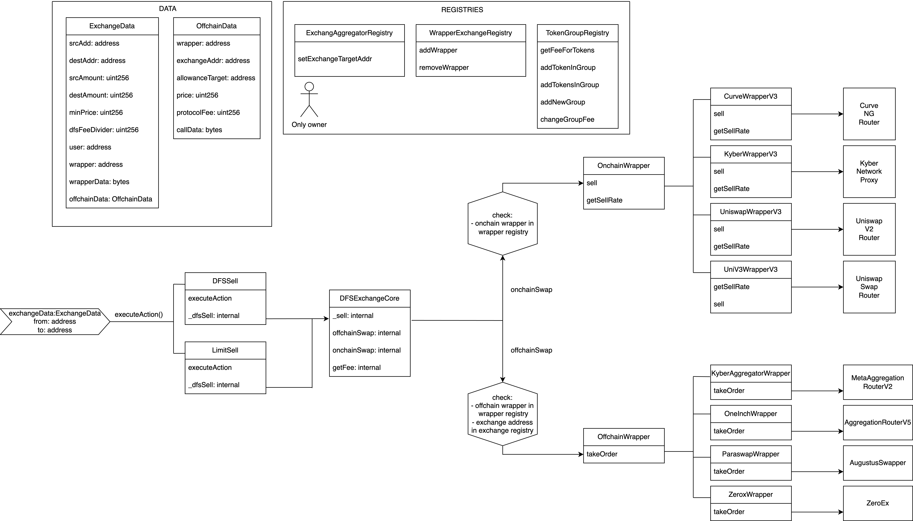

# Exchange

Token swaps at DeFi Saver are done in a fully non-custodial way, with tokens being swapped on-chain using decentralized exchanges and DEX aggregators to find the best swap rate at the moment.

<figure><figcaption>
Basic overview of Defi Saver exchange components
</figcaption></figure>
